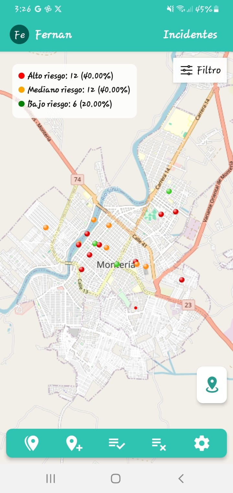
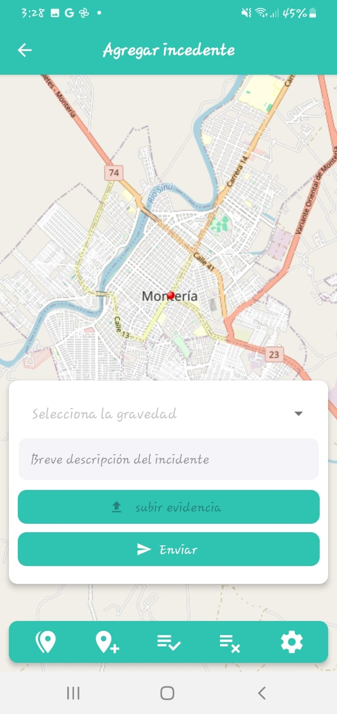
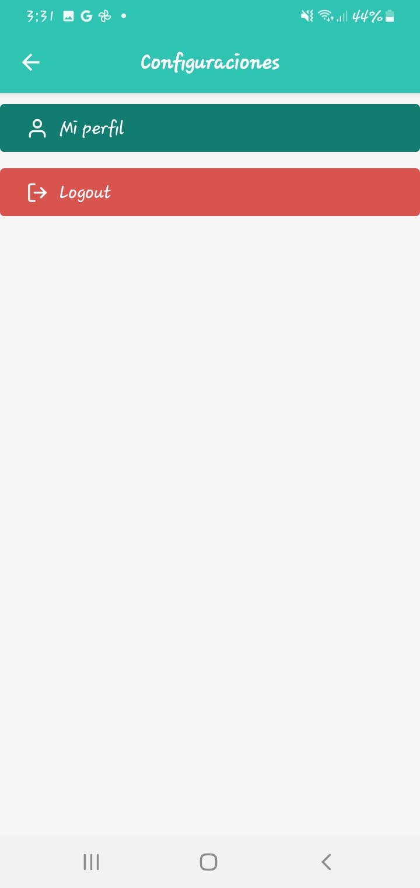

# React Native + Supabase

Aplicacion hecha con react native y supabase, para hacer reportes de incidentes de inseguridad, con opcion de subir evidencia en multimedia. Con panel administrativo para manejar posibles reportes falsos y hacer uso de los datos recopilados para hacer reportes con base en ellos.

